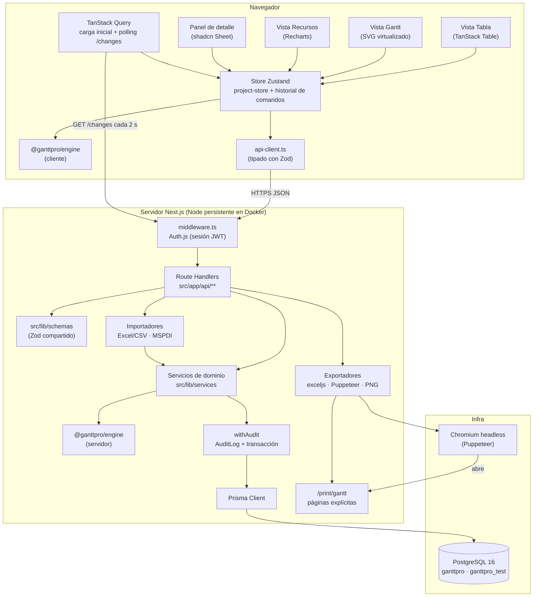

# Arquitectura — GanttPro

Documento de referencia de la arquitectura técnica. Las decisiones están justificadas una a una en
`docs/adr/`; este documento las conecta y muestra cómo fluyen los datos. Los nombres de entidades y
campos son los de `modelo-datos.md`; los casos de uso, los de `funcional.md`.

## Visión general

GanttPro es una aplicación web de una sola base de código (Next.js 15, App Router) con un motor de
planificación puro (`@ganttpro/engine`) que se ejecuta tanto en el navegador como en el servidor.
El navegador mantiene el proyecto abierto en un único store con historial de comandos y aplica los
cambios de forma optimista; el servidor los valida, los vuelve a calcular con el mismo engine, los
persiste en PostgreSQL y los audita. Otros usuarios reciben los cambios por polling sobre el
historial de auditoría. Las exportaciones a PDF y PNG reutilizan el mismo dibujo SVG del Gantt a
través de una ruta de impresión que Puppeteer convierte en archivo.

Principios:

1. **Un motor, dos lugares.** El engine calcula fechas, WBS, ruta crítica y carga de recursos. Es
   determinista y no tiene dependencias; por eso puede correr en cliente y servidor y dar el mismo
   resultado ([ADR-001](../adr/ADR-001-repositorio-unico-y-engine-puro.md)).
2. **Un solo estado en el cliente.** Tabla, Gantt, panel de detalle y recursos son proyecciones del
   mismo store ([ADR-008](../adr/ADR-008-store-unico-y-undo-redo.md)).
3. **El servidor es la verdad.** La respuesta de la API reconcilia el estado optimista; todo pasa por
   Zod, autorización por proyecto y `AuditLog` ([ADR-009](../adr/ADR-009-diseno-de-api.md)).
4. **Sin ambigüedad de fechas.** Fechas de plan date-only en todas las capas
   ([ADR-002](../adr/ADR-002-fechas-date-only.md)); semántica de planificación cerrada
   ([ADR-003](../adr/ADR-003-semantica-de-planificacion.md)).

## Diagrama de componentes



Responsabilidades por componente:

| Componente                 | Responsabilidad                                                                                        | Paso |
| -------------------------- | ------------------------------------------------------------------------------------------------------ | ---- |
| `@ganttpro/engine`         | Calendario, `scheduleProject`, WBS, `detectCycle`, CPM, `resourceLoad`, varianza, nivelación, `layout` | 2–3  |
| `prisma/schema.prisma`     | Modelo persistente según `modelo-datos.md`; migraciones; seeds                                         | 4    |
| `src/lib/auth`             | Auth.js, `getSessionUser`, `requireProject(role)`                                                      | 4    |
| `src/lib/audit`            | `withAudit`: transacción + fila de `AuditLog` con `summary` en español                                 | 4    |
| `src/lib/schemas`          | Esquemas Zod por entidad y operación; tipos derivados                                                  | 5    |
| `src/app/api/**`           | Route Handlers: CRUD, `PATCH /tasks/:id`, `move`, `bulk`, `changes`, `full`, export/import             | 5, 9 |
| `src/lib/api-client.ts`    | Cliente tipado; desenvuelve `{ data }` y convierte `{ error }` en `ApiError`                           | 5    |
| `src/stores/project-store` | Estado normalizado del proyecto, comandos, undo/redo, resaltado de `affected`                          | 6    |
| `src/components/table`     | Tabla WBS editable con teclado                                                                         | 6    |
| `src/components/gantt`     | SVG virtualizado, drag & drop, flechas; consume `layout`                                               | 7    |
| `src/app/print/gantt`      | Página de impresión paginada para PDF y PNG                                                            | 9    |
| `src/lib/export`, `import` | exceljs, Puppeteer, PNG; parsers Excel/CSV y MSPDI                                                     | 9    |
| `src/lib/holidays`         | Feriados de Chile por año como JSON estático; cargador al calendario del proyecto                      | 4    |

## Flujo: el usuario arrastra una barra

```mermaid
sequenceDiagram
    autonumber
    actor U as Usuario
    participant G as Vista Gantt (SVG)
    participant S as Store Zustand
    participant EC as Engine (cliente)
    participant A as api-client
    participant RH as PATCH /api/tasks/:id
    participant ES as Engine (servidor)
    participant DB as Prisma / Postgres

    U->>G: pointerdown en la barra de 1.3, arrastra 3 días
    loop cada pointermove
        G->>EC: scheduleProject(previsualización con anchorDate tentativo)
        EC-->>G: fechas tentativas de 1.3 y sucesoras
        G-->>U: barras fantasma con snap a día hábil
    end
    U->>G: pointerup
    G->>S: dispatch(MoveTask("1.3", "2026-09-21"))
    S->>EC: apply(): scheduleProject + criticalPath
    EC-->>S: tareas cambiadas (1.3, 1.4, 2.1, resumen 1)
    S-->>G: re-render inmediato (optimista); historial += comando
    S->>A: patchTask(id, { anchorDate: "2026-09-21" })
    A->>RH: PATCH (Zod valida; requireProject EDITOR)
    RH->>DB: cargar proyecto completo
    RH->>ES: scheduleProject + criticalPath (misma función)
    ES-->>RH: tareas cambiadas
    RH->>DB: withAudit: actualizar tareas + AuditLog (RESCHEDULE)
    RH-->>A: { data: { task, affected: [1.4, 2.1, 1] } }
    A-->>S: reconciliar; highlightUntil = ahora + 1 s en affected
    S-->>G: filas resaltadas 1 s
    Note over S,RH: Si la API responde error, el store ejecuta invert() y muestra el mensaje.
```

Puntos clave del flujo:

- Durante el arrastre no se toca el store ni la red: solo un estado local de previsualización y el
  engine en el cliente.
- Un arrastre produce **un** comando y **una** petición, aunque afecte a cien sucesoras.
- Cliente y servidor ejecutan la misma función con los mismos datos; la reconciliación normalmente es
  un no-op. Si difieren (cambio concurrente), gana el servidor.
- El polling de otros usuarios ignora las filas de `AuditLog` propias y aplica las ajenas con el mismo
  `applyServerChanges` ([ADR-010](../adr/ADR-010-colaboracion-por-polling.md)).

## Flujo: exportar a PDF

1. El usuario elige opciones en el diálogo (orientación, tamaño, rango, escala, columnas, toggles);
   `pdfOptionsToQuery` las serializa en la URL.
2. `GET /api/projects/:id/export/pdf?…` valida las opciones con Zod (`parsePdfOptions`) y
   `requireProjectAccess("VIEWER")`.
3. El handler firma un token HMAC de 5 minutos y abre con Puppeteer
   `/print/gantt?projectId=…&token=…&opciones`, que pagina el proyecto con `paginate` y renderiza
   páginas explícitas usando el mismo modelo de layout y la misma geometría SVG de la vista web.
4. `page.pdf()` devuelve el PDF vectorial; el handler lo envía como `application/pdf`
   ([ADR-007](../adr/ADR-007-pdf-con-puppeteer.md)).

## Flujo: importar un plan

1. El usuario elige un archivo en el diálogo Importar; `POST /api/import/preview` (multipart) lo
   parsea según su extensión (`csv.ts`, `excel.ts` o `mspdi.ts`) hacia un `ImportedPlan` neutral y
   lo valida fila a fila sin tocar la base de datos.
2. La previsualización muestra las tareas, los conteos y los errores y avisos por fila. Con errores,
   el botón Importar queda deshabilitado.
3. Al confirmar, `POST /api/import` recibe el plan en JSON, lo **vuelve a validar** con la misma
   función y, en una transacción, crea el proyecto (o agrega/reemplaza en uno existente), sus
   tareas, dependencias, recursos y asignaciones, y termina con `rescheduleProject`: las fechas
   finales las decide el engine ([ADR-011](../adr/ADR-011-importacion-con-previsualizacion.md)).

## Estructura de carpetas objetivo

```
/
├─ CLAUDE.md · README.md · prompt-claude-code-gantt.md
├─ docs/
│  ├─ spec/{funcional,modelo-datos,arquitectura,plan-de-pasos}.md
│  ├─ adr/ADR-001…011-*.md
│  ├─ qa/{checklist.md,evidencia/}
│  ├─ registro-pasos.md · manual-usuario.md · backlog.md
├─ packages/engine/                 # @ganttpro/engine, TypeScript puro
│  ├─ src/{dates,calendar,wbs,schedule,cycles,cpm,resources,baseline,level,layout,index}.ts
│  └─ tests/**.test.ts
├─ prisma/{schema.prisma,migrations/,seed.ts,seed-perf.ts}
├─ src/
│  ├─ app/(app)/…                   # proyectos, tabla, gantt, recursos, configuración
│  ├─ app/api/…                     # Route Handlers
│  ├─ app/print/gantt/              # ruta de impresión que Puppeteer convierte en PDF
│  ├─ app/login · app/share/[token] · app/health
│  ├─ components/{ui,gantt,table,resources,layout,…}
│  ├─ lib/{schemas,db,auth,audit,services,api-client,export,import,holidays}
│  ├─ stores/                       # project-store + comandos
│  └─ test/                         # factorías y helpers de tests de integración
├─ e2e/                             # Playwright
├─ fixtures/                        # msproject-sample.xml, plantilla.xlsx
├─ docker/postgres/init/            # creación de ganttpro_test
├─ docker-compose.yml · docker-compose.prod.yml · Dockerfile
└─ .github/workflows/ci.yml
```

## Capas y reglas de dependencia

| Capa               | Puede importar de                                                 | No puede importar de                |
| ------------------ | ----------------------------------------------------------------- | ----------------------------------- |
| `packages/engine`  | nada externo                                                      | `react`, `next`, `@prisma/*`, `@/*` |
| `src/lib/schemas`  | `zod`, tipos del engine                                           | Prisma, React                       |
| `src/lib/services` | engine, Prisma, `audit`, `schemas`                                | React, componentes                  |
| `src/app/api`      | `services`, `schemas`, `auth`                                     | componentes, stores                 |
| `src/stores`       | engine, `api-client`, `schemas`                                   | Prisma, `services`                  |
| `src/components`   | `stores`, `schemas`, engine (`layout`, `dates`), `api-client`, UI | Prisma, `services`                  |

La primera fila la impone ESLint; las demás se revisan en código y se añaden como reglas
`no-restricted-imports` por carpeta cuando existan (Paso 5 y 6).

## Convenciones transversales

- **Idioma:** UI, mensajes de error, comentarios, documentación y commits en español (Chile).
  Identificadores (variables, funciones, tablas, columnas, rutas de API, archivos de código) en
  inglés. Sin framework i18n: los textos viven en los componentes; si algún día se traduce, se
  extraen entonces.
- **Feriados de Chile:** JSON estático por año en `src/lib/holidays/cl-<año>.json` (2025–2027 en v1)
  con `{ date, name }`. La configuración del proyecto ofrece "Cargar feriados de Chile <año>", que
  inserta filas en `Holiday` del calendario base. Un adaptador `HolidayProvider` deja el hueco para
  una fuente externa en v2 sin tocar la UI.
- **Valor UF:** `Setting.ufValue` ingresado manualmente; adaptador `UfProvider` con implementación
  `ManualUfProvider` y hueco para `MindicadorUfProvider` en v2.
- **Fechas:** date-only en toda la pila; formato de presentación configurable
  (`Setting.dateFormat`, default `dd-mm-yyyy`).
- **Errores:** envolvente única de la API; mensajes accionables en español; códigos estables.
- **Flujo de trabajo:** un paso del plan = un commit + tag `paso-N`, con lint, typecheck y tests
  verdes antes de commitear (Husky) y en CI (GitHub Actions, Node 22; servicio Postgres desde el
  Paso 5).
- **Entorno:** Windows 11 + PowerShell; todo script npm usa `cross-env`/`rimraf`; el repo fuerza LF
  con `.gitattributes`.

## Índice de ADRs

| ADR                                                                      | Una frase                                                                                         |
| ------------------------------------------------------------------------ | ------------------------------------------------------------------------------------------------- |
| [ADR-001](../adr/ADR-001-repositorio-unico-y-engine-puro.md)             | Un repo; engine puro en `packages/engine` como workspace, frontera impuesta por ESLint y tsconfig |
| [ADR-002](../adr/ADR-002-fechas-date-only.md)                            | Fechas de plan `YYYY-MM-DD` y `@db.Date`; aritmética en epoch day; tests con `TZ=UTC`             |
| [ADR-003](../adr/ADR-003-semantica-de-planificacion.md)                  | Tareas ASAP con `anchorDate`; resúmenes derivados sin dependencias; esfuerzo informativo          |
| [ADR-004](../adr/ADR-004-postgres-unico-y-despliegue-docker.md)          | Solo PostgreSQL 16 en Docker; despliegue self-hosted con proceso Node persistente                 |
| [ADR-005](../adr/ADR-005-autenticacion-temprana-y-roles-por-proyecto.md) | Auth.js desde el Paso 4; roles por proyecto en `ProjectMember`; `AuditLog.userId` siempre         |
| [ADR-006](../adr/ADR-006-render-del-gantt-en-svg.md)                     | Gantt en SVG virtualizado con modelo de layout puro compartido con PNG y PDF                      |
| [ADR-007](../adr/ADR-007-pdf-con-puppeteer.md)                           | PDF vectorial con Puppeteer sobre `/print/gantt` con páginas explícitas                           |
| [ADR-008](../adr/ADR-008-store-unico-y-undo-redo.md)                     | Store Zustand único con comandos invertibles; optimista en cliente, verdad en servidor            |
| [ADR-009](../adr/ADR-009-diseno-de-api.md)                               | Route Handlers + Zod compartido + envolvente `{ data } \| { error }`; `affected` en una respuesta |
| [ADR-010](../adr/ADR-010-colaboracion-por-polling.md)                    | Polling de 2 s sobre `AuditLog`; última escritura gana; SSE reservado para v2                     |
| [ADR-011](../adr/ADR-011-importacion-con-previsualizacion.md)            | Importar en dos fases con validación por fila; un solo plan intermedio para CSV, Excel y MSPDI    |

## Riesgos y mitigaciones

| Riesgo                                                          | Impacto                                            | Mitigación                                                                                                                                        |
| --------------------------------------------------------------- | -------------------------------------------------- | ------------------------------------------------------------------------------------------------------------------------------------------------- |
| Rendimiento con 1.000 tareas (render, drag, reprogramación)     | Gantt lento, requisito de < 16 ms/frame incumplido | Virtualización obligatoria; índice de días hábiles O(1); engine < 50 ms medido en Vitest (Paso 2); `seed-perf` y test e2e de rendimiento (Paso 7) |
| Puppeteer en Docker (Chromium, memoria, fuentes)                | PDF falla en producción aunque funcione en dev     | Imagen con Chromium del sistema y fuentes; navegador reutilizado con cierre por inactividad; smoke test de PDF dentro del contenedor (Paso 11)    |
| Concurrencia con "última escritura gana"                        | Una edición sobrescribe otra sin aviso previo      | Toast con `summary` del cambio ajeno; historial completo en `AuditLog`; pila de rehacer invalidada; e2e de dos contextos (Paso 10)                |
| Divergencia entre engine cliente y servidor                     | Estado optimista distinto del persistido           | Misma función y mismos datos; reconciliación con `affected`; property test de 50 operaciones (Paso 7)                                             |
| Windows/PowerShell (rutas, EOL, symlinks de workspace, puertos) | Scripts que fallan solo en la máquina del usuario  | `cross-env`, `rimraf`, `.gitattributes` LF, `POSTGRES_PORT`; CI en Ubuntu detecta lo inverso                                                      |
| Duplicación de tipos Prisma ↔ engine                            | Desfase silencioso al cambiar el schema            | Adaptadores únicos en `src/lib/services/mappers.ts` con tests; `modelo-datos.md` como fuente de nombres                                           |
| Importación desde MS Project con dependencias sobre resúmenes   | Pérdida de enlaces al importar                     | Conversión a la primera/última hoja con advertencia por fila en la previsualización (Paso 9); fixture con ese caso                                |
| Crecimiento de `AuditLog`                                       | Feed de cambios lento con el tiempo                | Índice `(projectId, createdAt)`; paginación por cursor; retención configurable (Paso 11)                                                          |
