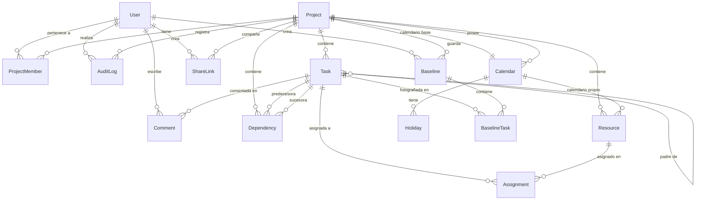

# Modelo de datos — GanttPro

Fuente de verdad para los nombres de entidades y campos. El schema de Prisma (Paso 4), la API
(Paso 5) y la UI usan exactamente estos nombres: entidades en `PascalCase`, campos en `camelCase`,
enumeraciones en `UPPER_SNAKE_CASE`.

Convenciones transversales:

- Identificadores: `id String @id @default(cuid())`.
- Fechas de plan (`anchorDate`, `startDate`, `endDate`, `date`, `statusDate`): tipo `DATE` en
  Postgres (`@db.Date`), transportadas como string ISO `YYYY-MM-DD`. Sin hora ni zona horaria.
- Marcas de tiempo técnicas (`createdAt`, `updatedAt`, `revokedAt`, `expiresAt`): `TIMESTAMPTZ`.
- Montos y tarifas: `Decimal(12, 4)`. Porcentajes: entero 0–100 salvo `allocationPct`, que puede
  superar 100 (una persona asignada al 150 % está sobreasignada por definición).
- Toda entidad de dominio cuelga de un `projectId` directo o indirecto para que la autorización
  pueda verificarse por proyecto.

## Diagrama entidad-relación

## Enumeraciones

| Enumeración         | Valores                                                                 | Uso                                |
| ------------------- | ----------------------------------------------------------------------- | ---------------------------------- |
| `ProjectStatus`     | `ACTIVE`, `ARCHIVED`                                                    | `Project.status`                   |
| `ProgressWeighting` | `DURATION`, `EFFORT`                                                    | `Project.progressWeighting`        |
| `TaskStatus`        | `NOT_STARTED`, `IN_PROGRESS`, `DONE`, `ON_HOLD`, `CANCELLED`            | `Task.status`                      |
| `TaskPriority`      | `LOW`, `MEDIUM`, `HIGH`, `CRITICAL`                                     | `Task.priority`                    |
| `DependencyType`    | `FS`, `SS`, `FF`, `SF`                                                  | `Dependency.type`                  |
| `ResourceType`      | `PERSON`, `TEAM`, `MATERIAL`                                            | `Resource.type`                    |
| `Currency`          | `UF`, `CLP`                                                             | `Resource.rateCurrency`, `Setting` |
| `ProjectRole`       | `ADMIN`, `EDITOR`, `VIEWER`                                             | `ProjectMember.role`               |
| `AuditAction`       | `CREATE`, `UPDATE`, `DELETE`, `MOVE`, `RESCHEDULE`, `IMPORT`, `RESTORE` | `AuditLog.action`                  |

## Diccionario de datos

### User

Usuario autenticado. Los roles no son globales: se asignan por proyecto en `ProjectMember`.

| Campo          | Tipo     | Oblig. | Reglas                                           |
| -------------- | -------- | ------ | ------------------------------------------------ |
| `id`           | String   | sí     | cuid                                             |
| `email`        | String   | sí     | único, minúsculas                                |
| `name`         | String   | sí     |                                                  |
| `passwordHash` | String   | no     | bcrypt; nulo si el usuario solo entra con Google |
| `image`        | String   | no     | URL de avatar                                    |
| `createdAt`    | DateTime | sí     |                                                  |
| `updatedAt`    | DateTime | sí     |                                                  |

### Project

| Campo               | Tipo              | Oblig. | Reglas                                                                                        |
| ------------------- | ----------------- | ------ | --------------------------------------------------------------------------------------------- |
| `id`                | String            | sí     |                                                                                               |
| `name`              | String            | sí     | 1–120 caracteres                                                                              |
| `description`       | String            | no     |                                                                                               |
| `status`            | ProjectStatus     | sí     | default `ACTIVE`; archivado = solo lectura                                                    |
| `startDate`         | Date              | sí     | fecha de inicio del proyecto; ancla por defecto de tareas nuevas                              |
| `statusDate`        | Date              | no     | fecha de estado para cálculo de atraso; nulo = hoy                                            |
| `progressWeighting` | ProgressWeighting | sí     | default `DURATION`; cómo ponderar el avance de tareas resumen                                 |
| `calendarId`        | —                 | —      | (eliminado en el Paso 4) el calendario base es el `Calendar` del proyecto con `isBase = true` |
| `createdById`       | String            | sí     | FK a `User`                                                                                   |
| `archivedAt`        | DateTime          | no     |                                                                                               |
| `createdAt`         | DateTime          | sí     |                                                                                               |
| `updatedAt`         | DateTime          | sí     |                                                                                               |

Índices: `status`, `createdById`.

### Calendar

Calendario laboral. Cada proyecto tiene exactamente uno base (`isBase = true`, garantizado por un índice único parcial creado en la migración inicial); un recurso puede tener el suyo. Se modela así, y no con `Project.calendarId`, para evitar la dependencia circular de claves foráneas al crear un proyecto.

| Campo         | Tipo     | Oblig. | Reglas                                                                                   |
| ------------- | -------- | ------ | ---------------------------------------------------------------------------------------- |
| `id`          | String   | sí     |                                                                                          |
| `projectId`   | String   | sí     | FK a `Project`; el calendario pertenece al proyecto que lo usa                           |
| `name`        | String   | sí     |                                                                                          |
| `isBase`      | Boolean  | sí     | true en el calendario base del proyecto; índice único parcial `(projectId) WHERE isBase` |
| `workingDays` | Int[]    | sí     | días de la semana laborables, 0 = domingo … 6 = sábado; default `[1,2,3,4,5]`            |
| `hoursPerDay` | Decimal  | sí     | > 0; default 8                                                                           |
| `createdAt`   | DateTime | sí     |                                                                                          |
| `updatedAt`   | DateTime | sí     |                                                                                          |

Índices: `projectId`.

### Holiday

| Campo        | Tipo   | Oblig. | Reglas                |
| ------------ | ------ | ------ | --------------------- |
| `id`         | String | sí     |                       |
| `calendarId` | String | sí     | FK a `Calendar`       |
| `date`       | Date   | sí     | único por calendario  |
| `name`       | String | sí     | ej. "Fiestas Patrias" |

Índices: único `(calendarId, date)`.

### Task

Nodo del WBS. La jerarquía es ilimitada mediante `parentId`. Los campos marcados como _derivados_
los calcula el engine y se persisten para consultas y reportes; la API rechaza su edición directa.

| Campo            | Tipo         | Oblig. | Derivado | Reglas                                                                                                                  |
| ---------------- | ------------ | ------ | -------- | ----------------------------------------------------------------------------------------------------------------------- |
| `id`             | String       | sí     |          |                                                                                                                         |
| `projectId`      | String       | sí     |          | FK a `Project`                                                                                                          |
| `parentId`       | String       | no     |          | FK a `Task` del mismo proyecto; nulo = nivel raíz                                                                       |
| `orderIndex`     | Int          | sí     |          | posición entre hermanos, 0-based, contigua                                                                              |
| `wbsCode`        | String       | sí     | sí       | "1", "1.1", "1.1.2"…; se recalcula al reordenar o reindentar                                                            |
| `name`           | String       | sí     |          | 1–200 caracteres                                                                                                        |
| `description`    | String       | no     |          |                                                                                                                         |
| `anchorDate`     | Date         | no     |          | intención del usuario ("no empezar antes de"); obligatorio en tareas hoja, nulo en resúmenes                            |
| `startDate`      | Date         | sí     | sí       | hoja: max(`anchorDate`, derivado de predecesoras); resumen: min de hijos                                                |
| `endDate`        | Date         | sí     | sí       | hoja: `startDate` + `durationDays` en días hábiles; resumen: max de hijos                                               |
| `durationDays`   | Int          | sí     |          | días hábiles ≥ 0; 0 solo si `isMilestone`; en resúmenes es derivado                                                     |
| `effortHours`    | Decimal      | no     |          | informativo; se usa para ponderar avance si `progressWeighting = EFFORT`                                                |
| `progressPct`    | Int          | sí     |          | 0–100; en resúmenes es derivado (ponderado)                                                                             |
| `status`         | TaskStatus   | sí     |          | default `NOT_STARTED`; pasa a `IN_PROGRESS`/`DONE` automáticamente al cambiar `progressPct` salvo `ON_HOLD`/`CANCELLED` |
| `priority`       | TaskPriority | sí     |          | default `MEDIUM`                                                                                                        |
| `color`          | String       | no     |          | hex `#RRGGBB`; nulo = color por defecto de la vista                                                                     |
| `isMilestone`    | Boolean      | sí     |          | default false; implica `durationDays = 0` y `startDate = endDate`                                                       |
| `isSummary`      | Boolean      | sí     | sí       | true si tiene hijos                                                                                                     |
| `isCritical`     | Boolean      | sí     | sí       | resultado del CPM                                                                                                       |
| `totalFloatDays` | Int          | no     | sí       | holgura total en días hábiles (CPM)                                                                                     |
| `freeFloatDays`  | Int          | no     | sí       | holgura libre en días hábiles (CPM)                                                                                     |
| `notes`          | String       | no     |          | markdown                                                                                                                |
| `createdAt`      | DateTime     | sí     |          |                                                                                                                         |
| `updatedAt`      | DateTime     | sí     |          |                                                                                                                         |
| `updatedById`    | String       | no     |          | FK a `User`; último editor                                                                                              |

Índices: `projectId`, `(projectId, parentId, orderIndex)`, `(projectId, wbsCode)`.

Reglas de integridad que aplica la API:

- Una tarea no puede ser su propio ancestro (reindentar bajo un descendiente se rechaza).
- Eliminar una tarea elimina en cascada sus descendientes, sus `Dependency`, `Assignment`,
  `Comment` y `BaselineTask`.
- Una tarea con hijos (`isSummary`) no puede ser `isMilestone` ni participar en `Dependency`.

### Dependency

| Campo           | Tipo           | Oblig. | Reglas                                                 |
| --------------- | -------------- | ------ | ------------------------------------------------------ |
| `id`            | String         | sí     |                                                        |
| `projectId`     | String         | sí     | FK a `Project`; ambas tareas deben pertenecer a él     |
| `predecessorId` | String         | sí     | FK a `Task`                                            |
| `successorId`   | String         | sí     | FK a `Task`; distinta de la predecesora                |
| `type`          | DependencyType | sí     | default `FS`                                           |
| `lagDays`       | Int            | sí     | default 0; negativo = adelanto (lead); en días hábiles |
| `createdAt`     | DateTime       | sí     |                                                        |

Índices: único `(predecessorId, successorId)`, `projectId`, `successorId`.

Reglas: no se aceptan ciclos (el engine devuelve el ciclo como lista de `wbsCode`); ninguna de las
dos tareas puede ser resumen.

### Resource

| Campo                 | Tipo         | Oblig. | Reglas                                                          |
| --------------------- | ------------ | ------ | --------------------------------------------------------------- |
| `id`                  | String       | sí     |                                                                 |
| `projectId`           | String       | sí     | FK a `Project`                                                  |
| `name`                | String       | sí     |                                                                 |
| `type`                | ResourceType | sí     | default `PERSON`                                                |
| `email`               | String       | no     |                                                                 |
| `rate`                | Decimal      | sí     | tarifa por hora; default 0                                      |
| `rateCurrency`        | Currency     | sí     | default `UF`                                                    |
| `capacityHoursPerDay` | Decimal      | sí     | > 0; default 8. Para `MATERIAL` se interpreta como unidades/día |
| `calendarId`          | String       | no     | FK a `Calendar`; nulo = usa el calendario base del proyecto     |
| `color`               | String       | no     | hex                                                             |
| `isActive`            | Boolean      | sí     | default true; inactivo no se ofrece para nuevas asignaciones    |
| `createdAt`           | DateTime     | sí     |                                                                 |
| `updatedAt`           | DateTime     | sí     |                                                                 |

Índices: `projectId`.

### Assignment

| Campo           | Tipo     | Oblig. | Reglas                             |
| --------------- | -------- | ------ | ---------------------------------- |
| `id`            | String   | sí     |                                    |
| `taskId`        | String   | sí     | FK a `Task`; no puede ser resumen  |
| `resourceId`    | String   | sí     | FK a `Resource` del mismo proyecto |
| `allocationPct` | Int      | sí     | > 0; default 100                   |
| `createdAt`     | DateTime | sí     |                                    |

Índices: único `(taskId, resourceId)`, `resourceId`.

Horas asignadas = `Task.durationDays × Calendar.hoursPerDay × allocationPct / 100`.
Costo = horas asignadas × `Resource.rate` (convertido a la moneda de visualización con el valor UF de `Setting`).

### Baseline

Máximo 5 por proyecto (regla de aplicación, no de base de datos).

| Campo         | Tipo     | Oblig. | Reglas                 |
| ------------- | -------- | ------ | ---------------------- |
| `id`          | String   | sí     |                        |
| `projectId`   | String   | sí     | FK a `Project`         |
| `name`        | String   | sí     | único por proyecto     |
| `createdById` | String   | sí     | FK a `User`            |
| `createdAt`   | DateTime | sí     | fecha de la fotografía |

Índices: único `(projectId, name)`.

### BaselineTask

Fotografía inmutable de una tarea en el momento de guardar la baseline.

| Campo          | Tipo   | Oblig. | Reglas          |
| -------------- | ------ | ------ | --------------- |
| `id`           | String | sí     |                 |
| `baselineId`   | String | sí     | FK a `Baseline` |
| `taskId`       | String | sí     | FK a `Task`     |
| `wbsCode`      | String | sí     | copia           |
| `name`         | String | sí     | copia           |
| `startDate`    | Date   | sí     | copia           |
| `endDate`      | Date   | sí     | copia           |
| `durationDays` | Int    | sí     | copia           |
| `progressPct`  | Int    | sí     | copia           |

Índices: único `(baselineId, taskId)`.

Varianza (calculada, no persistida): `startVarianceDays = workingDaysBetween(baseline.startDate, task.startDate)`,
`endVarianceDays` análogo, `progressVariancePct = task.progressPct − baseline.progressPct`.

### ProjectMember

| Campo       | Tipo        | Oblig. | Reglas                                                                           |
| ----------- | ----------- | ------ | -------------------------------------------------------------------------------- |
| `id`        | String      | sí     |                                                                                  |
| `projectId` | String      | sí     | FK a `Project`                                                                   |
| `userId`    | String      | sí     | FK a `User`                                                                      |
| `role`      | ProjectRole | sí     | `ADMIN` gestiona miembros y baselines; `EDITOR` edita el plan; `VIEWER` solo lee |
| `createdAt` | DateTime    | sí     |                                                                                  |

Índices: único `(projectId, userId)`, `userId`. El creador del proyecto es `ADMIN` automáticamente.

### AuditLog

Historial de cambios. Alimenta la vista de auditoría, el feed de colaboración (`changes?since=`) y
la trazabilidad de undo/redo.

| Campo         | Tipo        | Oblig. | Reglas                                                                                                  |
| ------------- | ----------- | ------ | ------------------------------------------------------------------------------------------------------- |
| `id`          | String      | sí     |                                                                                                         |
| `projectId`   | String      | sí     | FK a `Project`                                                                                          |
| `userId`      | String      | sí     | FK a `User`; quién                                                                                      |
| `entityType`  | String      | sí     | nombre de la entidad: `Task`, `Dependency`, `Resource`…                                                 |
| `entityId`    | String      | sí     |                                                                                                         |
| `action`      | AuditAction | sí     |                                                                                                         |
| `operationId` | String      | no     | agrupa las entradas de una misma operación (ej. un `RESCHEDULE` en cascada); lo usa undo/redo y el feed |
| `before`      | Json        | no     | estado previo (nulo en `CREATE`)                                                                        |
| `after`       | Json        | no     | estado posterior (nulo en `DELETE`)                                                                     |
| `summary`     | String      | sí     | texto en español para la UI: "movió la tarea 1.2 al 15-03-2026"                                         |
| `createdAt`   | DateTime    | sí     | cursor del feed de cambios                                                                              |

Índices: `(projectId, createdAt)`, `(entityType, entityId)`, `userId`.

### Comment

| Campo        | Tipo     | Oblig. | Reglas                                  |
| ------------ | -------- | ------ | --------------------------------------- |
| `id`         | String   | sí     |                                         |
| `taskId`     | String   | sí     | FK a `Task`                             |
| `authorId`   | String   | sí     | FK a `User`                             |
| `body`       | String   | sí     | markdown; menciones como `@email`       |
| `mentionIds` | String[] | sí     | ids de `User` mencionados; default `[]` |
| `createdAt`  | DateTime | sí     |                                         |
| `updatedAt`  | DateTime | sí     |                                         |

Índices: `(taskId, createdAt)`.

### ShareLink

Enlace de solo lectura a un proyecto.

| Campo         | Tipo     | Oblig. | Reglas                       |
| ------------- | -------- | ------ | ---------------------------- |
| `id`          | String   | sí     |                              |
| `projectId`   | String   | sí     | FK a `Project`               |
| `token`       | String   | sí     | único, aleatorio de 32 bytes |
| `createdById` | String   | sí     | FK a `User`                  |
| `createdAt`   | DateTime | sí     |                              |
| `expiresAt`   | DateTime | no     | nulo = sin vencimiento       |
| `revokedAt`   | DateTime | no     | no nulo = enlace inválido    |

Índices: único `token`, `projectId`.

### Setting

Configuración global de la instalación (clave/valor).

| Campo         | Tipo     | Oblig. | Reglas                                                                              |
| ------------- | -------- | ------ | ----------------------------------------------------------------------------------- |
| `key`         | String   | sí     | PK. Claves v1: `ufValue`, `ufValueDate`, `dateFormat`, `displayCurrency`, `logoUrl` |
| `value`       | Json     | sí     |                                                                                     |
| `updatedById` | String   | no     | FK a `User`                                                                         |
| `updatedAt`   | DateTime | sí     |                                                                                     |

## Reglas de derivación (resumen)

| Dato derivado                                                        | Cuándo se recalcula                                                                                         | Quién                      |
| -------------------------------------------------------------------- | ----------------------------------------------------------------------------------------------------------- | -------------------------- |
| `Task.wbsCode`, `Task.isSummary`                                     | crear, eliminar, mover, indentar, desindentar                                                               | engine `wbs`               |
| `Task.startDate`, `Task.endDate` (hoja)                              | cambio de `anchorDate`, `durationDays`, dependencias, calendario                                            | engine `schedule`          |
| `Task.startDate`, `endDate`, `durationDays`, `progressPct` (resumen) | cualquier cambio en descendientes                                                                           | engine `schedule` (rollup) |
| `Task.isCritical`, `totalFloatDays`, `freeFloatDays`                 | tras cada `schedule`                                                                                        | engine `cpm`               |
| `Task.status` automático                                             | cambio de `progressPct` (0 → `NOT_STARTED`, 1–99 → `IN_PROGRESS`, 100 → `DONE`) salvo `ON_HOLD`/`CANCELLED` | API                        |

## Volumen esperado

Seed de demostración: 1 proyecto, ≈40 tareas en 3 niveles, 6 recursos, 25 dependencias, 2 hitos,
feriados de Chile 2026. Seed de rendimiento: 1.000 tareas y ≈1.500 dependencias. Los índices por
`projectId` y `(projectId, parentId, orderIndex)` cubren las consultas de carga del proyecto completo,
que es la operación dominante (el cliente carga el proyecto entero y el engine trabaja en memoria).
